<h1>Here are the Screenshots of Outputs</h1>

## 1. Implement a function that checks whether a given string is a palindrome or not.

  <a>
    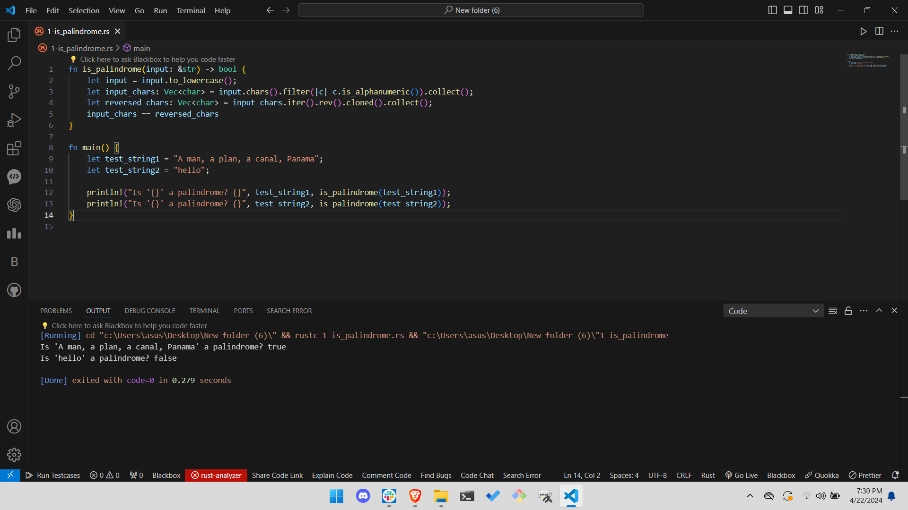
  </a>
    

## 2. Given a sorted array of integers, implement a function that returns the index of the first occurrence of a given number.

  <a>
    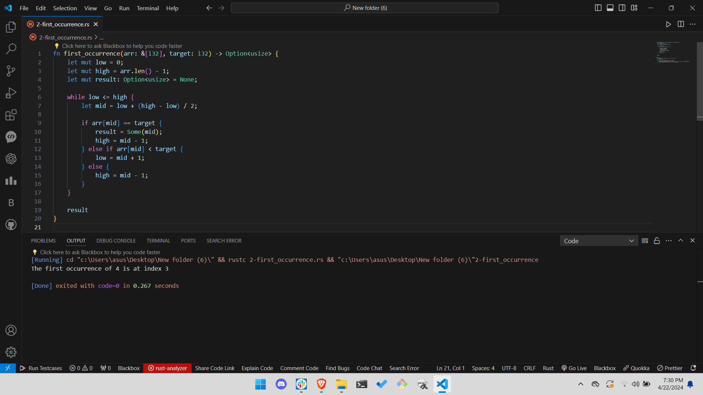
  </a>
    

## 3. Given a string of words, implement a function that returns the shortest word in the string.

  <a>
    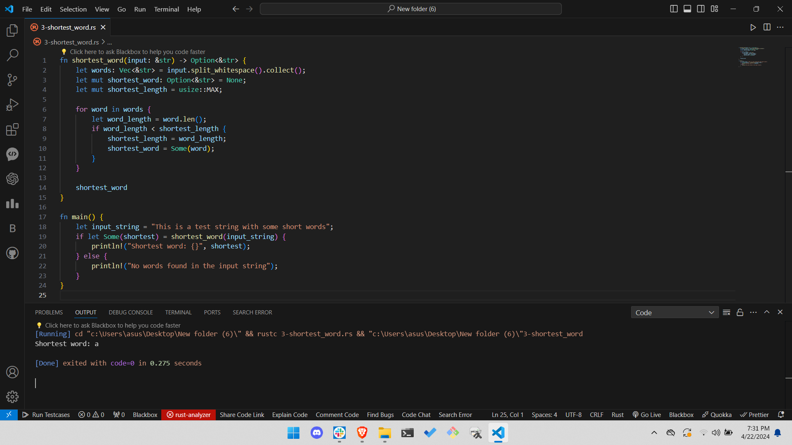
  </a>
    

## 4. Implement a function that checks whether a given number is prime or not.

  <a>
    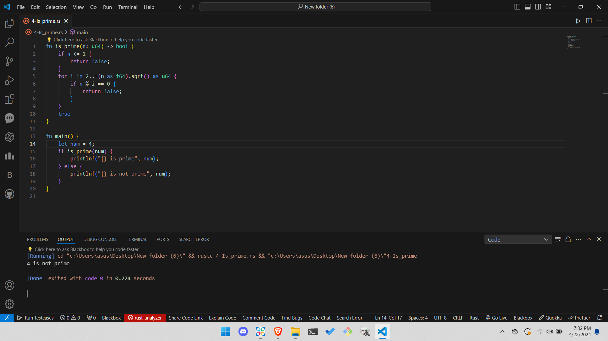
  </a>
    

## 5. Given a sorted array of integers, implement a function that returns the median of the array.

  <a>
    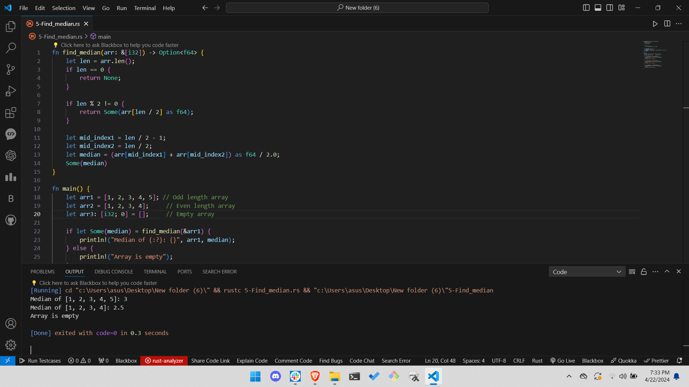
  </a>
    

## 6. Implement a function that finds the longest common prefix of a given set of strings.

  <a>
    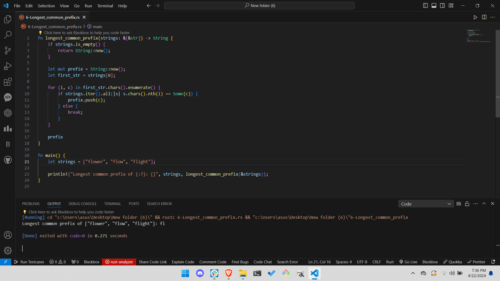
  </a>
    

## 7. Implement a function that returns the kth smallest element in a given array. 

  <a>
    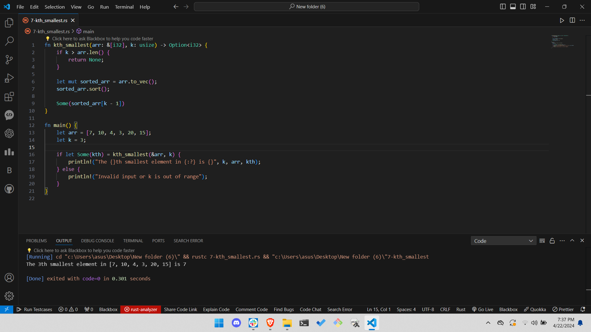
  </a>
    

## 8. Given a binary tree, implement a function that returns the maximum depth of the tree.

  <a>
    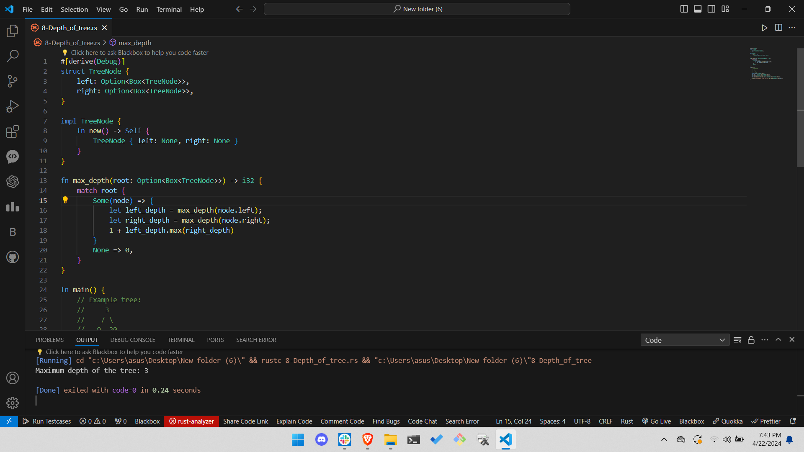
  </a>
    

## 9. Reverse a string in Rust

  <a>
    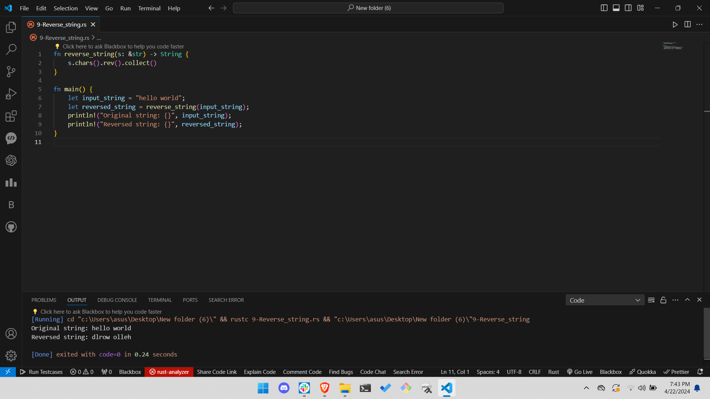
  </a>
    

## 10. Check if a number is prime in Rust

  <a>
    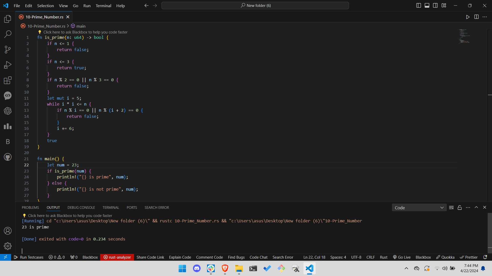
  </a>
    

## 11. Merge two sorted arrays in Rust

  <a>
    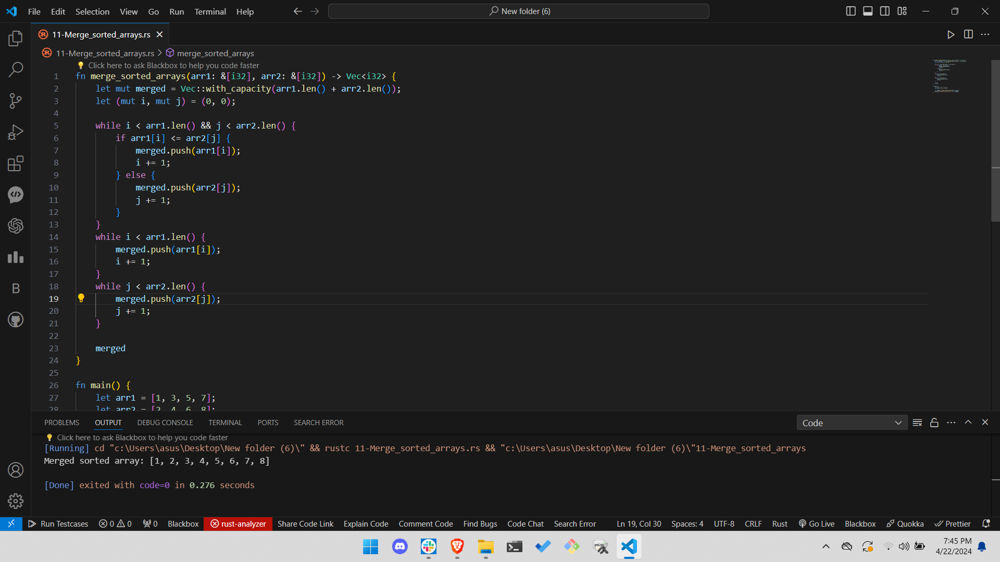
  </a>
    

## 12. Find the maximum subarray sum in Rust

  <a>
    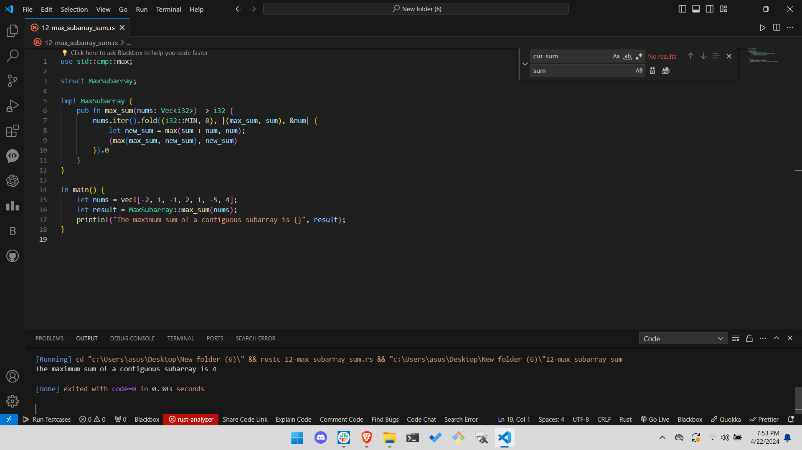
  </a>
    
